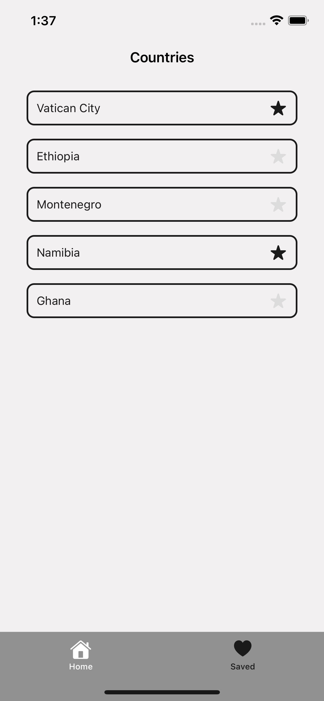
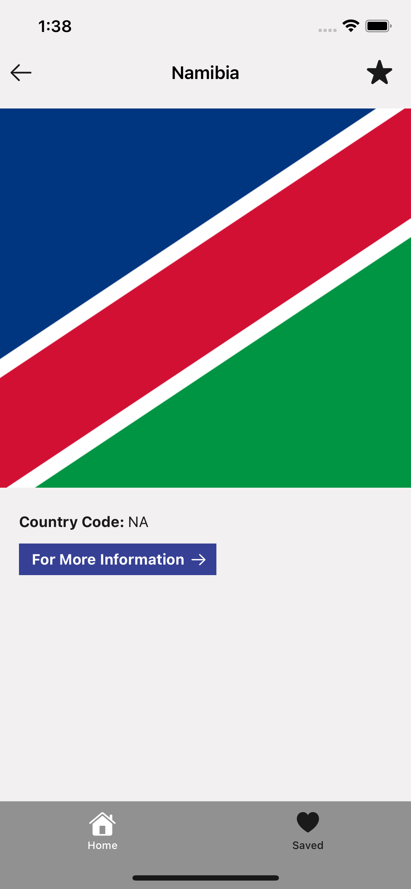
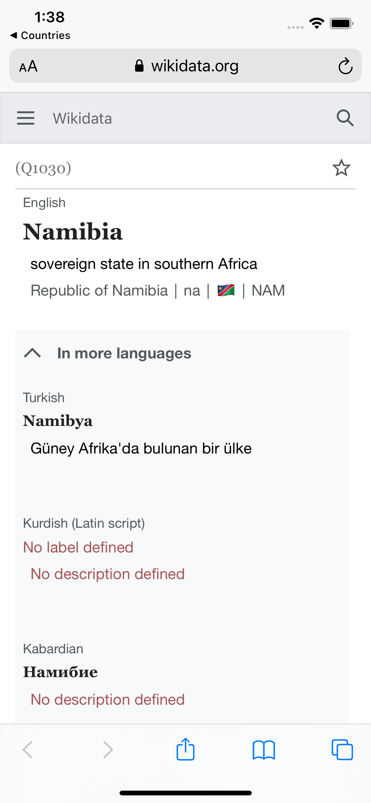
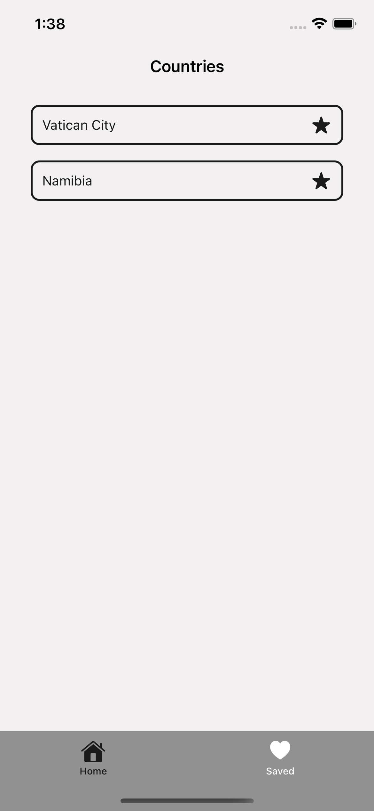

# Countries

## Intro
- The application consists of 2 tabs and 3 separate pages in total. Home, Detail, Saved.

## Home
- Shows a list of countries.
- User can add and remove a country from the Saved list by pressing the star.
- User will be able to go to Detail page by selecting a country.

## Detail
- User will see the Country's details on this page.
- User can add and remove a country from the Saved list by pressing the star.
- Details: country name, country code, country flag and relevant wikidata link.

 

## Saved
- User can see saved countries on this page.
- User can remove a country from the Saved list by pressing the star.
- User will be able to go to Detail page by selecting a country.

